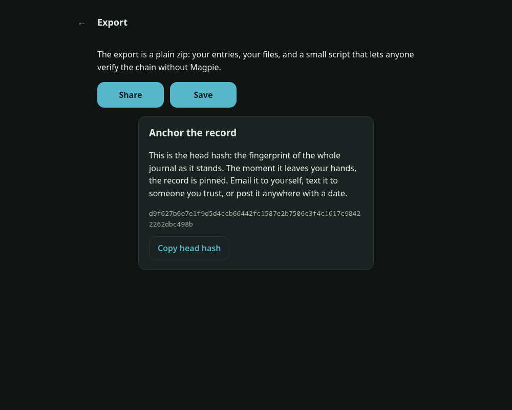

# Magpie

  

A journal that can prove itself.

People document the disputes in their lives with a camera roll and a notes
app: the leak the landlord ignored, the messages that keep arriving, the
state the car came back in. Then months later it matters, and what they
have is a pile of files with shiftable dates that proves nothing about
when anything was written down.

Magpie is an incident journal with receipts. Every entry, a photo, a note,
a file, gets hashed together with the entry before it. Change one word
anywhere in the record, reorder it, delete something from the middle, and
the final hash stops matching. Everything is encrypted on your device with
your passphrase; locked means unreadable, including to the app.

The export is the point. One zip holds your files, the chain manifest, and
a small python script. Anyone can run it, no Magpie required, and confirm
the whole record is exactly as chained. And the head hash, one line, pins
the entire journal: email it to yourself or anyone you trust, and from
that moment you can prove the record existed in exactly this state.

  

## Get it

Android: install [magpie.apk](https://github.com/munzzyy/magpie/releases/latest/download/magpie.apk)
(the link always points at the current release, so Obtainium can track
it). Web: serve `app/` from any static host; no build step, no server
side.

## Check the claims

`npm test` runs the chain, crypto, and zip suites. The export verifier is
re-implemented in pure python stdlib and tested against JS-built exports
with deliberate tampering, so the two can never silently drift. `npm run
e2e` drives the real app in Chromium and then greps the raw IndexedDB
bytes for the test's plaintext canaries: titles, notes, and attachment
bytes must never appear unencrypted at rest, and the exported zip is
verified by python, outside the app. The Android APK requests no
permissions; photos arrive through the system camera app, and the OS
refuses every network connection.

## What it is not

Read [docs/THREAT-MODEL.md](docs/THREAT-MODEL.md). The short version:
tamper-evident is not court-admissible (talk to a lawyer), device
timestamps are claims until the head hash is anchored somewhere with a
date, there is no passphrase recovery on purpose, and no app survives a
device your adversary already controls.

## Run it

Web: serve `app/` from any static host, or `node test/serve_local.mjs`
locally. No build step, no dependencies. Android:
`cd android && ./gradlew assembleRelease`.

MIT.
