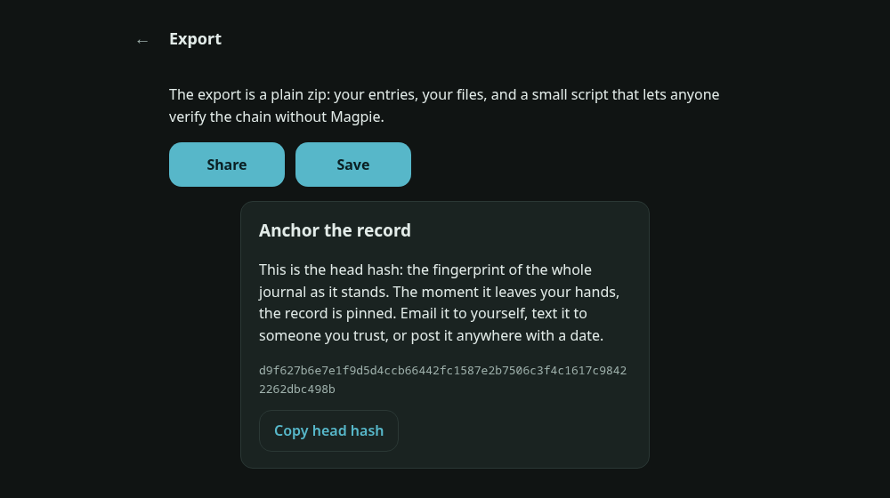

# Magpie

[](https://github.com/munzzyy/magpie/releases/latest) [](https://github.com/munzzyy/magpie/actions/workflows/ci.yml) [](LICENSE)

[](https://f-droid.org/packages/io.github.munzzyy.magpie/)
[](https://tern.munzzyy.dev/add/?url=https%3A%2F%2Fgithub.com%2Fmunzzyy%2Fmagpie)

A journal that can prove itself.

People document the disputes in their lives with a camera roll and a notes
app: the leak the landlord ignored, the messages that keep arriving, the
state the car came back in. Then months later it matters, and what they
have is a pile of files with shiftable dates that proves nothing about
when anything was written down.

Magpie is an incident journal with receipts. Every entry, a photo, a note,
a file, gets hashed together with the entry before it. Change one word
anywhere in the record, reorder it, delete something from the middle, and
the final hash stops matching. Everything is encrypted on your device with
your passphrase; locked means unreadable, including to the app.

The export is the point. One zip holds your files, the chain manifest, and
a small Python script that confirms the whole record is exactly as chained,
no Magpie required to run it, just Python's standard library and someone
technical to run it: a lawyer's IT person, a techie friend. And the head
hash, one line, pins the entire journal: email it to yourself or anyone you
trust, and from that moment you can prove the record existed in exactly
this state.

<p align="center">
  
</p>

## Get it

Android: install [magpie.apk](https://github.com/munzzyy/magpie/releases/latest/download/magpie.apk)
on Android 9 or newer. Magpie is not in the Play Store yet, so Android
will warn you about installing from outside it; that warning is expected
for any app distributed this way, not a sign something is wrong. The link
always points at the current release, so a release-tracking installer
(e.g. [Tern](https://github.com/munzzyy/tern)) can update it
automatically without going through a store.

On Android 9 it works, but know two things. Google stopped shipping
security fixes for Android 9 after January 2022, so a phone that old is
easier to break into. Your journal is encrypted while it's locked, but while
it's open, anything that has broken in could read it. Magpie tells you this
once, the first time it opens on Android 9. It also needs Android System
WebView 84 or newer. Phones that update through Google Play should have that
already, and on an older one Magpie shows how to update it rather than a
blank screen. Exports on Android 9 open the system save picker, since an app
can't write to Downloads there without a storage permission.

On the web it is a static page with no server side at all. Open
[magpie.munzzyy.dev](https://magpie.munzzyy.dev), which is this repo's `app/`
served as plain files, or run your own copy: `node test/serve_local.mjs`
serves it locally, or serve `app/` from anywhere that serves plain files.

## iOS

There is a native wrapper too: the same `app/` in a WKWebView, no server,
nothing it can reach out to. It is not on the App Store, so building it
means Xcode and your own signing, which is real friction for a phone owner
who is not a developer. The shortcut is the web version: open
[magpie.munzzyy.dev](https://magpie.munzzyy.dev) in Safari, tap Share, then
"Add to Home Screen". Details, including the Xcode steps and how the two
differ, in [docs/IOS.md](docs/IOS.md).

## Check the claims

`npm test` runs the chain, crypto, service-worker, and zip suites; the
zip suite cross-checks against python3 and system unzip, so have both
around. The export verifier is re-implemented in pure Python stdlib and
tested against JS-built exports
with deliberate tampering, so the two can never silently drift. `npm run
e2e` drives the real app in Chromium and then greps the raw IndexedDB
bytes for the test's plaintext canaries: titles, notes, and attachment
bytes must never appear unencrypted at rest, and the exported zip is
verified by Python, outside the app. The APK requests no Android
permissions; its one manifest entry is androidx's self-scoped
not-exported marker, which grants nothing, and CI fails the build if
anything real ever appears. Photos arrive through the system camera app,
and the OS refuses every network connection.

## What it is not

Read [docs/THREAT-MODEL.md](docs/THREAT-MODEL.md). The short version:
tamper-evident is not court-admissible (talk to a lawyer), device
timestamps are claims until the head hash is anchored somewhere with a
date, there is no passphrase recovery on purpose, and no app survives a
device your adversary already controls.

## Run it

For development: `node test/serve_local.mjs` serves the web app, and
`cd android && ./gradlew assembleDebug` builds an installable debug APK
(release signing goes through `tools/release-android.sh`).

## Bugs, holes, contributions

A way to change a chained entry without breaking verification is the bug
that matters; [SECURITY.md](SECURITY.md) has the private route for that.
Everything else: issues and pull requests are open and welcome. Releases
list the APK's sha256 and signing certificate digest, and
[docs/THREAT-MODEL.md](docs/THREAT-MODEL.md) says plainly what the chain
does and does not prove.

**What that hash actually proves today: not much on its own.** It is the
same developer publishing a hash next to the binary they built it from, so
it tells you the file you downloaded matches the file GitHub is serving,
nothing about whether it matches this source tree. `tools/release-android.sh`
never runs in CI, only on the machine that signs the release, so there is
no independent build to compare against yet. A reproducible build (CI
builds the same commit unsigned and publishes that sha256 alongside the
signed release, so anyone can diff the two) would close that gap; it is not
built yet. Until it is, verifying the APK against this source means reading
the source and building it yourself.

[GPL-3.0-or-later](LICENSE). You can use, study, change and share it. If you distribute a copy or a modified version, it has to stay under the GPL and come with its source. Releases up to v0.4.3 were under MIT.

## Support

If you want to help keep Magpie going, you can sponsor on [GitHub Sponsors](https://github.com/sponsors/munzzyy) or send Monero to:

```
8BApLkfsBS39oNXz4L1qCmZ7f5zKVRr1qLJgrHddRZb4JRcnjDkcKdk7wW7uThCeV9CuLn8o7gAn8d6vFeWNiyeXSmrRUSq
```
